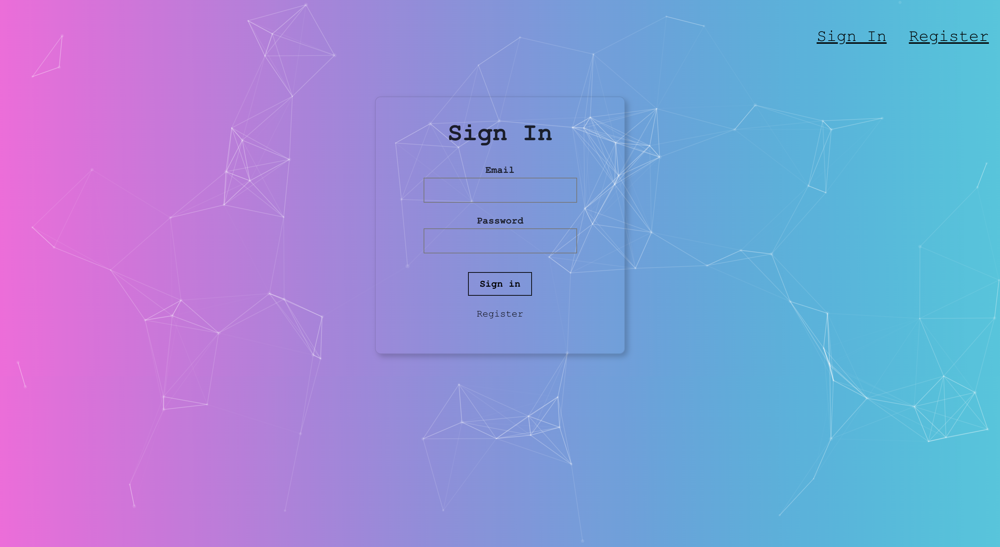

# ZTM Final Project - [Smart Brain App](https://smart-brain-tw.herokuapp.com/) - Frontend

This is the final project of the course "The Complete Web Developer in 2021: Zero to Mastery"

This is the "backend server" repo

The contents and functions include :
1. A signin page
2. A register page
3. A home page with image upload function which can face-detect (using Clarifai Api)

## Demo
click this link to go to the app : https://smart-brain-tw.herokuapp.com/

## Techniques using in this project
* React for the frontend app
* Tachyons for the style input
* Nodejs for the server
* PostgreSQL for the database
* Using Clarifai API to do face-detection
* Deploy the project to Heroku

## Functions introduction

### Signin page

* Users can either signin here or go to register page to register a new account

### Register page

* Users can register new account here

### Home page

* The home page shows the users' name
* The rank shows the face detect count
* Enter jpg url in the bar, press "Detect" button, the image will show, and the app will generate the blue block on the target once detect the face

